# MongoDB---Simple-CRUD
Heroku URL: <a href="https://nameless-depths-50060.herokuapp.com/">https://nameless-depths-50060.herokuapp.com/</a>
<h1>Department Managemnt</h1>
<ol>
    <li>Insert Department</li>
    <li>Update Department</li>
    <li>Delete Department</li>
    <li>Faetch All Department</li>
</ol>

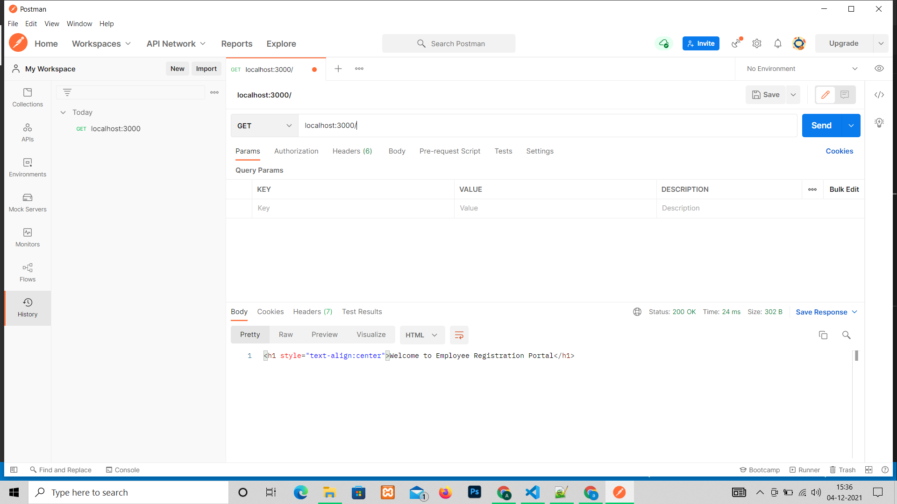

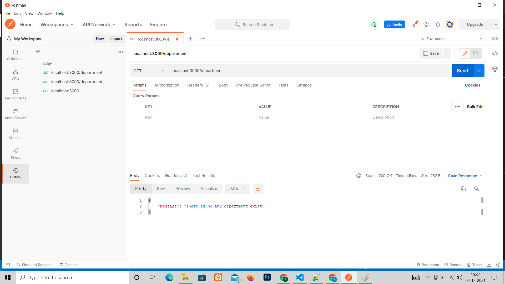

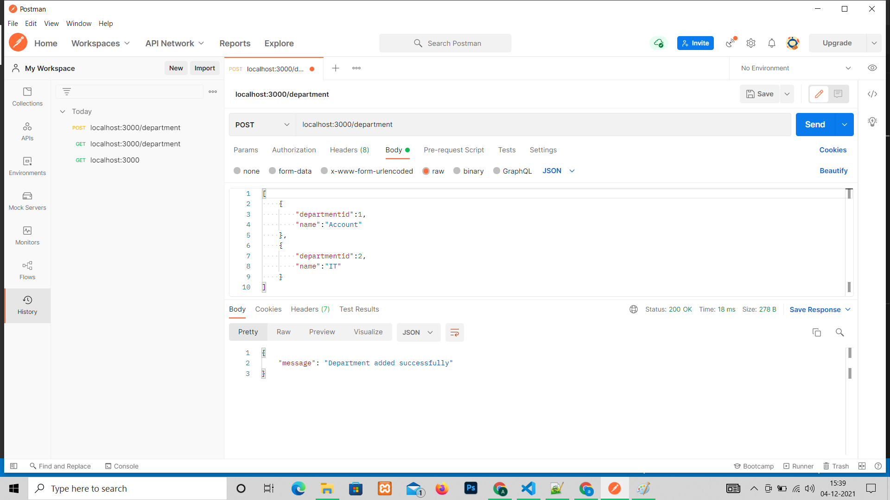

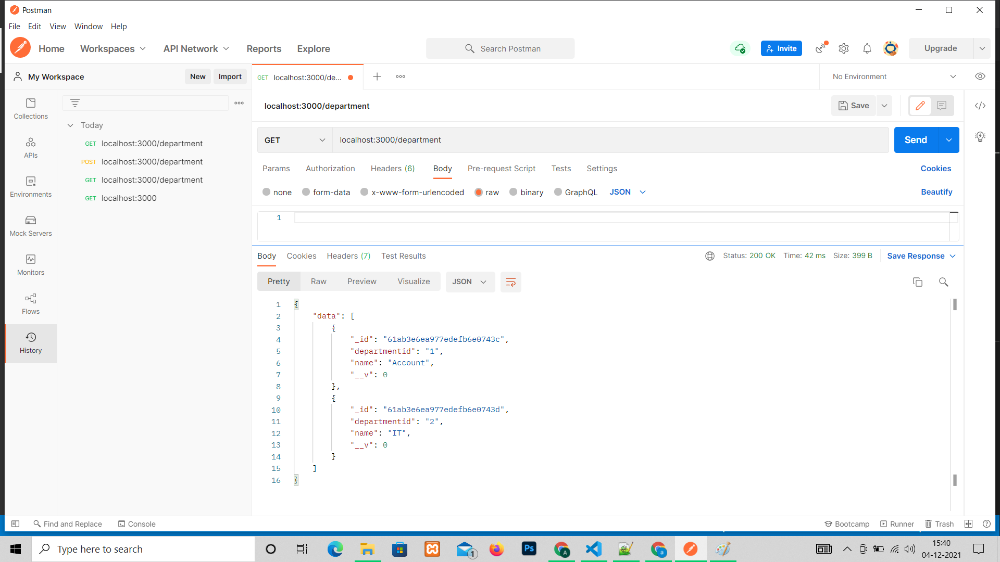

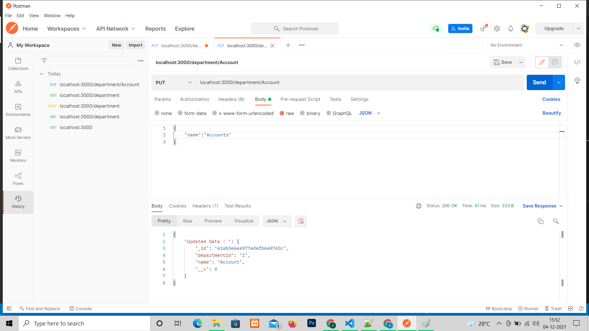

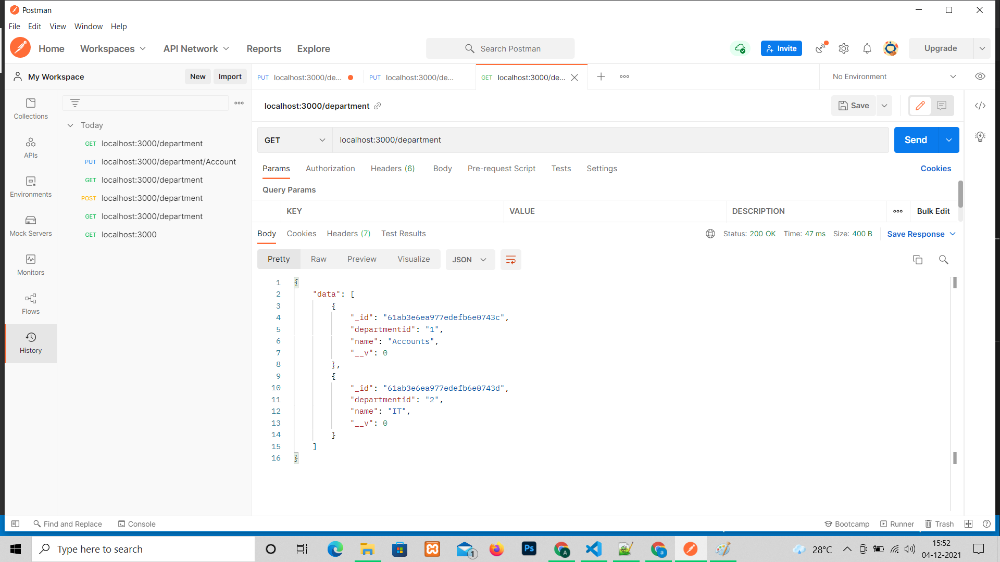

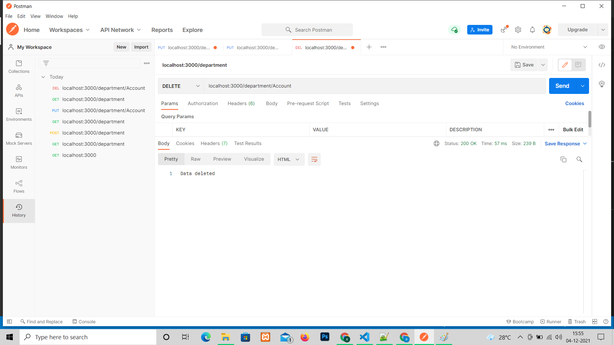

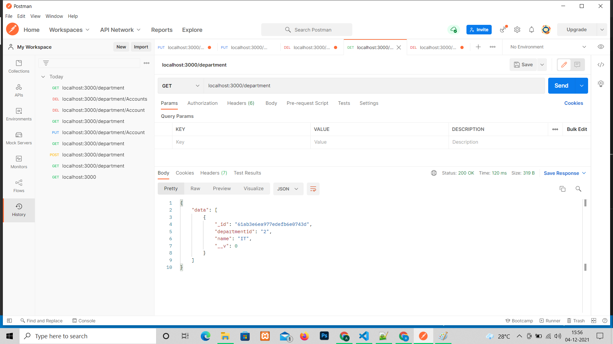

<h1>Employee Managemnt</h1>
<ol>
    <li>Insert Employee</li>
    <li>Update Employee</li>
    <li>Delete Employee</li>
    <li>Faetch All Employee</li>
</ol>

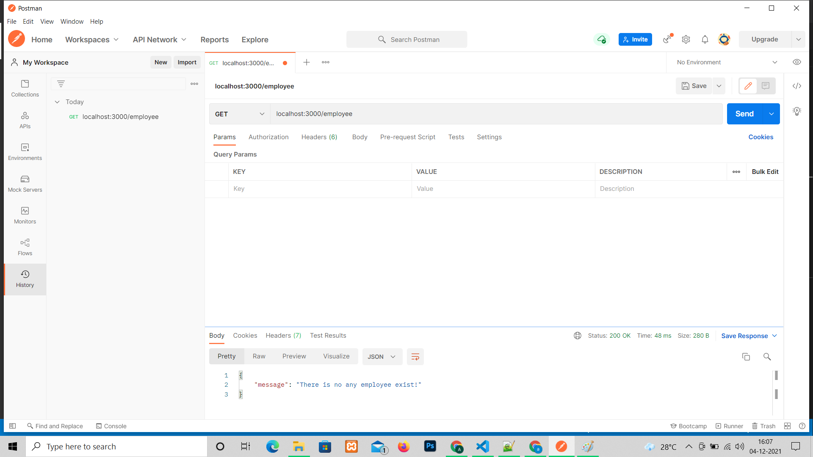

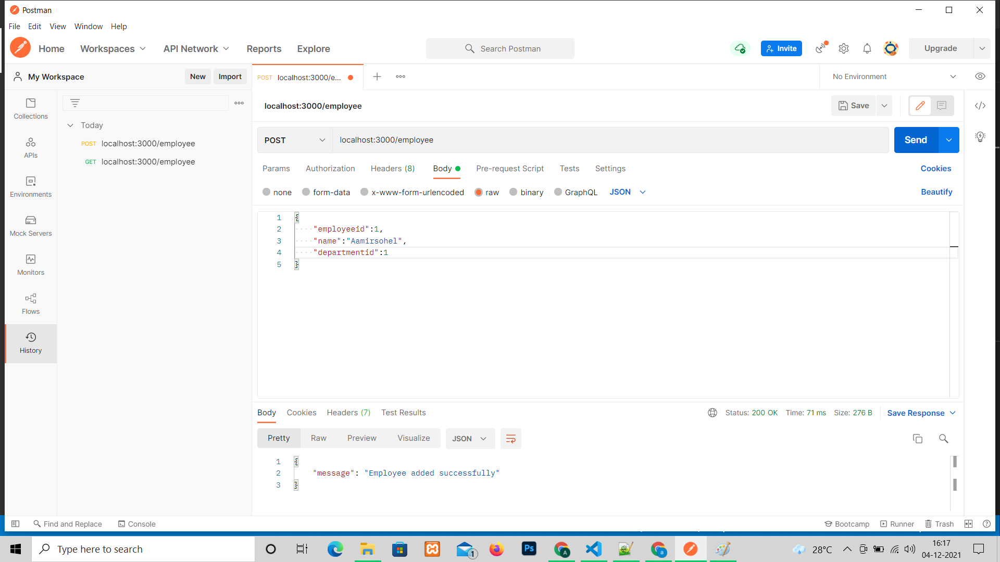

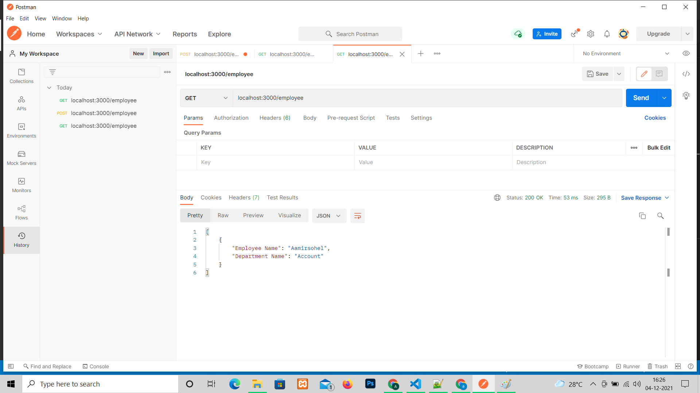

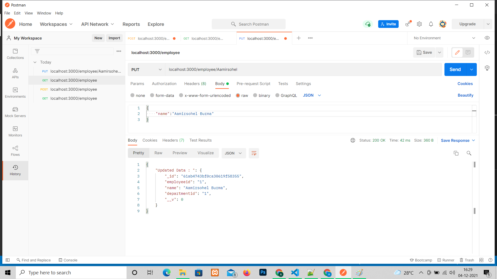

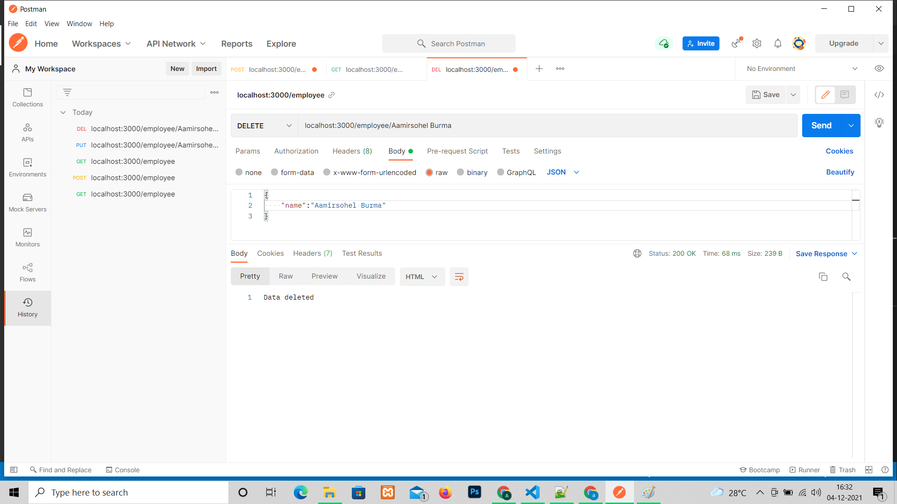

